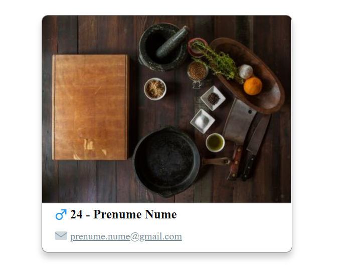

# 1) Starting a new React Project
This chapter goes through setting up a new React application and also how to create a few components to set up.

## Bootstrapping your React app
Open a CLI, navigate to this file and run the create-react-app CLI tool.
```bash
$ cd '.\1) Starting a new React Project\'
$ create-react-app react-workshop
```
This will bootstrap your React application. Name it however you like.

Once completed (it can take 1-2 min) navigate to the folder created and start the application
```bash
$ cd '.\react-workshop\'
$ npm start
```

This will start a development server at localhost:3000 with Live Reload (any change in the code will cause the application to reload)

**Hint: Have look at the default create-react-app boilerplate, it looks pretty**

## Creating the folder structure

#### Clear the clutter
* Remove logo.svg, serviceWorker.js, App.test.js files
* Fix imports and unused code:
  * in index.js: remove serviceWorker import and registration
  * in app.js: remove logo import and what is contained in the first <div> of the Application
  * remove the contents of the 2 CSS files

Now we can have a clean start on a truly empty Application.

#### Folder Structure
We have a simple mini app so the component folder structure will be:
* node_modules
* public *<- static resource folder*
* src
  * components *<- __create this folder for components__ 
    * ContactCard *<- folder continaing our new component*
      * ContactCard.js
      * ContactCard.css
  * App.js *<- js file for "App" component*
  * App.css *<- css file for "App" component*
  * index.css *<- global css*
  * index.js *<- main entry point in application, mounts "App" component*
* package.json
* package-lock.json
* .gitignore
* README.md

## Creating our first functional component

So, the result of this chapter should be a reusable component that takes in a few props and renders on screen according to the structure of our markup.

Steps: 
* Create the functional component
* Define the props in PropTypes
* Create the layout and styling 
* Test it out

#### Creating the functional component
```javascript
import React from 'react';

const ContactCard = (props) => {
    return <div>
        Contact Card Content Layout
    </div>
}

export default ContactCard;
```

The above structure defines a functional component. It has no state of it's own and is used to define reusable **presentation** components.

Go ahead and update our App.js file to see how our component is rendered on screen
```HTML
  <div className="App">
    <ContactCard />
    <ContactCard />
    <ContactCard />
    <ContactCard />
    <ContactCard />
  </div>
```

Ok, our component renders on screen now, but it's not really configurable. That's the role of props.

#### Define the props in PropTypes
Ok, our component is out and rendering, but we can't really do anything with it (except render the same thing over and over again, that's ok too)

[How to use PropTypes](https://reactjs.org/docs/typechecking-with-proptypes.html) <- detailed explantion

Esentially you define an interface for the props of your component.

```javascript
ContactCard.propTypes = {
  prop1: PropTypes.string,
  prop2: PropTypes.number
}
```

We need to define the Contact Card of a person, so we should define at least the following: 
* firstName
* lastName
* gender
* e-mail
* age
* imageUrl

#### Create the layout and styling 
Let's go ahead and create the layout. Mine looks like this: 


***Be creative here, don't overstress on CSS, make a simple layout***

It can also look like this too:


***Getting the React concepts are important***

#### Testing it out
You can test it right in the App.js by adding attributes (props) to our Cards:

```html
<ContactCard
  firstName="John"
  lastName="Doe"
  gender="male"
  age="24"
  eMail="john.doe@gmail.com"
  imageUrl="https://picsum.photos/200/300"
/>
```

**ProTip: Center your App layout by using this CSS:**
```CSS
 .App {
     width: 900px;
     margin: 50px auto;
 }
```

## Creating a searchbar

Let's create our SearchBar Component. Like before, create a folder for our new Component. Add a SearchBar.js and SearchBar.css to it. Feel free to style the taskbar as you wish
Creating this is similar to creating our previous card component, the slight difference is that this one has to react to change. In order to do that we need to pass it 2 things, what text is being rendered and what to do with it.


```javascript
import React from 'react';
import './SearchBar.css';
const SearchBar = ({ filterText, onUserInput }) => (
        <input
        // add the new value and the change here
        />);

export default SearchBar;
```

### Proptypes

Proptypes should be easy or this one, right? So let's add the 2 new fields "filterText" and "onUserInput" to the proptypes of this component as we did previously.

### Testing it out
Let's test our new component in the App.js file. Add this above the Cards.

```javascript
 <SearchBar onUserInput={(data) => console.log(data)} filterText={"Sometext"}/>
```

While you type you should see in the console the letters you are typing if all went well. For now, the change does not happend. That's something for the State to handle.

## Next Step

Right now we should have a Card Component that accepts some props and can render on screen and a SearchBar component that accepts a value and emmits back the change. We have just created our first display components!

Let's add some state into the mix.
